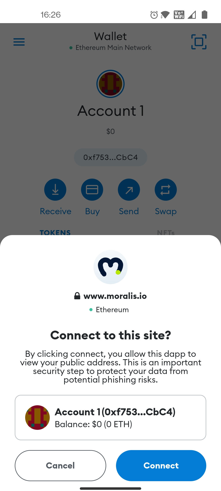

<h1>👋 Unity Moralis Wallet Connect Android Demo</h1>

<h3>Screenshots</h3>

| Screenshots |  |  |  |
|---|:---:|:---:|:---:|
|  |  |  |  |

<h1>🚀 Quick Start</h1>
<h3>Install Unity</h3>
<ul>
  <li>Download and install <a href="https://unity3d.com/get-unity/download">Unity Hub.</a></li>
  <li>Tested on Unity 2020.3.31f1</li>
</ul>
<h3>Open the project</h3>
<ul>
  <li>On Unity Hub, open the project by selecting the <b>unity-wallet-mobile</b> folder.
  <li>Once in Unity, go to <b>Scenes</b> and open <b>Main</b>.</li>
  <li>Connect your device, remember to have <b>USB Debugging</b> activated. Go to <b>Build Settings</b>, add the scene and <b>Build and Run!</b></li>
</ul>
